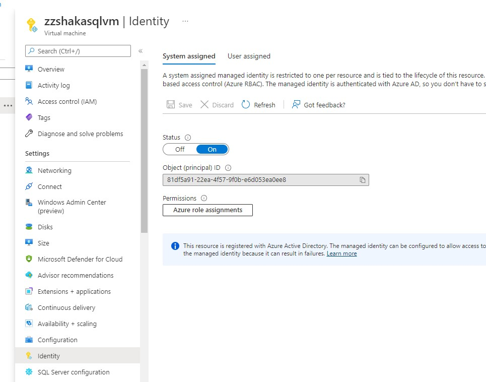
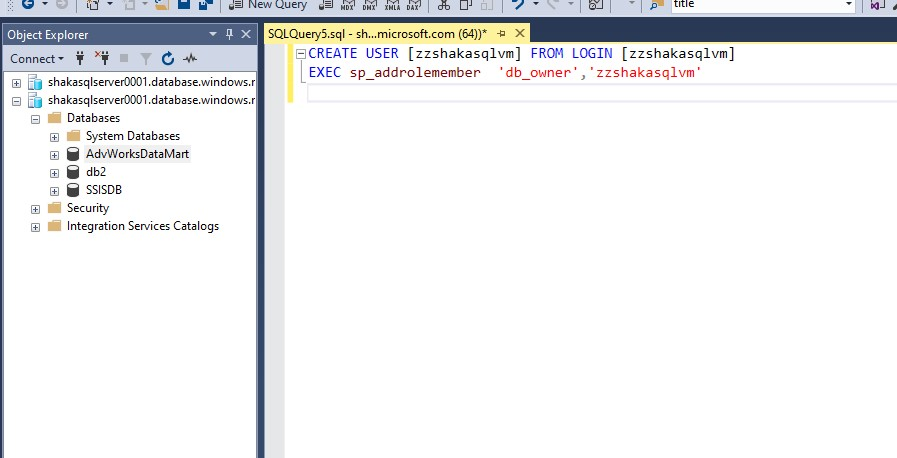
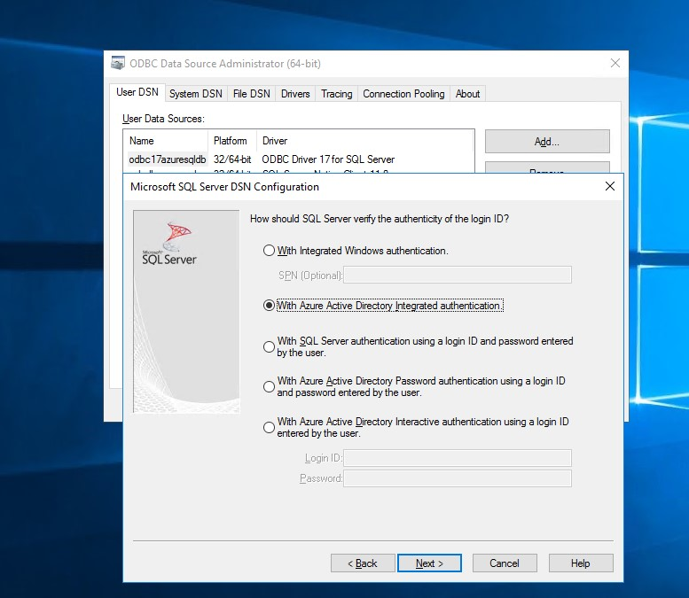
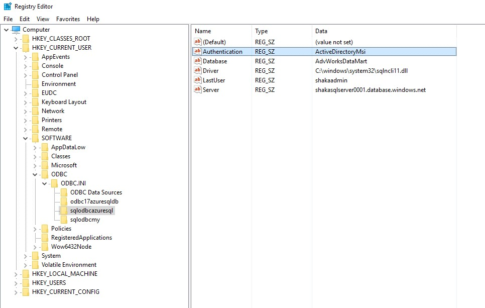

# Connect to Azure SQL using Azure VMs identity

Many organizations do not approve the use of SQL logins to Database due to various security concerns.

If your application that connects to Azure SQL DB or SQL MI is running on an Azure VM. You can avoid  SQL Logins and use the VMs identity to connect to Azure SQL DB/SQL MI.

Here are the steps (refer to screenshots below for more info)
1. Activate Managed Identity on Azure VM
2. Download ODBC Driver 17 on the VM
3. Grant VM identity access to Azure SQL DB or SQL MI (using external provider)
4. Setup a ODBC Datasource using ODBC 17
5. Update application connection string 

Applciation Connection string 
    "DSN=odbc17azuresqldb;Authentication=ActiveDirectoryMsi"

If application connection string change is not possible, update the windows registry to set the Authentication=ActiveDirectoryMsi parameter on the ODBC DSN

ODBC Driver 17 - https://www.microsoft.com/en-us/download/details.aspx?id=56567

MSI Auth - https://docs.microsoft.com/en-us/sql/connect/jdbc/connecting-using-azure-active-directory-authentication?view=sql-server-ver15

# Screenshots

### Active VM Identity

### Grant VM Identity Access to Azure SQL

### ODBC Setup

### Registry Change (Only if application connection string cannot be changed)

ODBC DSN UI Dialog box does not allow us to set MSI auth, this can be set  by modifying the windows registry entry (regedit.exe)

If the application can pass in the Authentication parameter as below in the connection string, then the registry change is not required
"DSN=odbc17azuresqldb;Authentication=ActiveDirectoryMsi"

